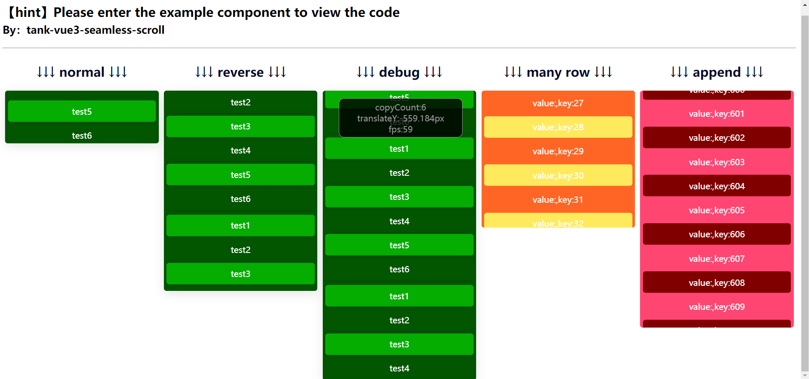

[English](README.md) | 中文

# tank-vue3-seamless-scroll


## features

* 这是一个高性能的无缝滚动插件
* 事件监听不会失效

## 警告
如果您打算对大量数据使用此插件，我们未做任何vue第三方组件针对性内存、cpu的虚拟优化，请谨慎选择

# 预览

[](https://user-images.githubusercontent.com/466966/233253193-66d316da-3803-41dc-b115-3d74ec2b8d8d.mp4)


[在线演示](./dist/index.html)
## 快速开始

### 安装

```shell
npm install --save tank-vue3-seamless-scroll
```

### 导入

```js
import TankSeamlessScroll from "tank-vue3-seamless-scroll"
```

### 使用组件

```html

<div style="height:300px;">
    <tank-seamless-scroll :step-length="25" :debug="true" :reverse="false">
        <div class="demo">
            <div v-for="i in 2" :key="i">测试{{ i }}</div>
        </div>
    </tank-seamless-scroll>
</div>
```

### api

#### step-length

* 描述：每秒移动像素高度
* 默认值: 60 (px/秒)
* 类型: Number

#### reverse

* 描述：动画将反向滚动播放
* 默认值: false
* 类型: Boolean

#### debug

* 描述：是否显示调试信息
* 默认值: false
* 类型: Boolean


